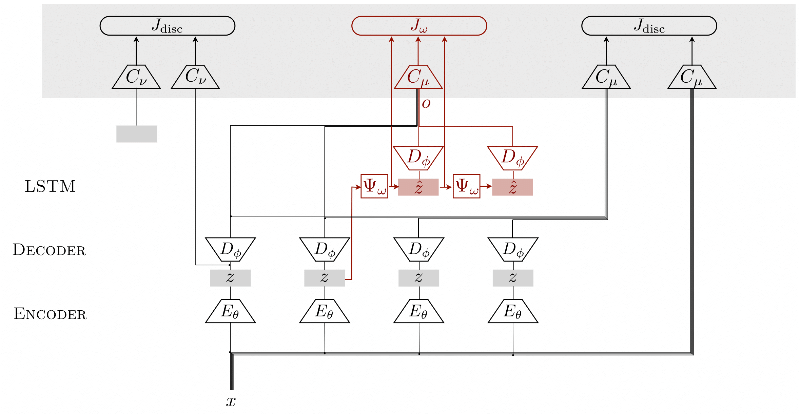

## AccentGAN: Generating Accented Speech using GANs

Samples can be listened to [here](http://accentgan.s3-website.ap-south-1.amazonaws.com/)

### Introduction

This is the repository of the AccentGAN project. 

In this paper, we propose the generation of accented speech using generative adversarial networks. Through this work we make two main contributions a) The ability to condition latent representations while generating realistic speech samples b) The ability to efficiently generate long speech samples by using a novel latent variable transformation module that is trained using policy gradients. Previous methods are limited in being able to generate only relatively short samples or are not very efficient at generating long samples. The generated speech samples are validated through a number of various evaluation measures viz, a WGAN critic loss and through subjective scores on user evaluations against competitive speech synthesis baselines and detailed ablation analysis of the proposed model. The evaluations demonstrate that the model generates realistic long speech samples conditioned on accent efficiently.



This model trains on speech samples at various frequencies and quality and learns to generate new samples from noise. The training disentangles content from accent, and allows us to generate similar content across accents. We can also transfer content between accents, and generate new samples from noise with the required accent.

**All the project is developed with TensorFlow**. There are three repositories that were good references on how GANs for speech are defined and deployed and we used them to write the code for our models:

* [improved-gan](https://github.com/openai/improved-gan): implementing improvements to train GANs in a more stable way
* [DCGAN-tensorflow](https://github.com/carpedm20/DCGAN-tensorflow): implementation of the DCGAN in tensorflow
* [SEGAN](https://github.com/santi-pdp/segan): implementation of Speech Enhancement GAN in tensorflow

### Dependencies

* Python 2.7
* TensorFlow 1.2

You can install the requirements either to your virtualenv or the system via pip with:

```
pip install -r requirements.txt
```

### Data

Download the data from [VCTK](http://homepages.inf.ed.ac.uk/jyamagis/page3/page58/page58.html) dataset from the Center for Speech Technology Research, University of Edinburgh

Then go and edit the file : ``` cfg/data.cfg ``` and add the relevant path of the dataset's wav48 folder in the said file under the head of ``` noisy ``` and ``` clean ```

Once that is done ``` ./prepare_data_vctk.sh ``` to prepare the required TFRecords.

### Training

Once you have the TFRecords file created in `data/vctk.tfrecords` you can simply run the training process with:

```
./train_segan.sh
```

By default this will take all the available GPUs in your system, if any. Otherwise it will just take the CPU.

**NOTE:** If you want to specify a subset of GPUs to work on, you can do so with the `CUDA_VISIBLE_DEVICES="0, 1, <etc>"` flag in the python execution within the training script. In the case of having two GPUs they'll be identified as 0 and 1, so we could just take the first GPU with: `CUDA_VISIBLE_DEVICES="0"`.


### Reference

If the code of this repository was useful for your research, please cite this repository.

The code for this was based on code presented by [SEGAN](https://github.com/santi-pdp/segan)
### Contact

e-mail: accentgan@gmail.com
